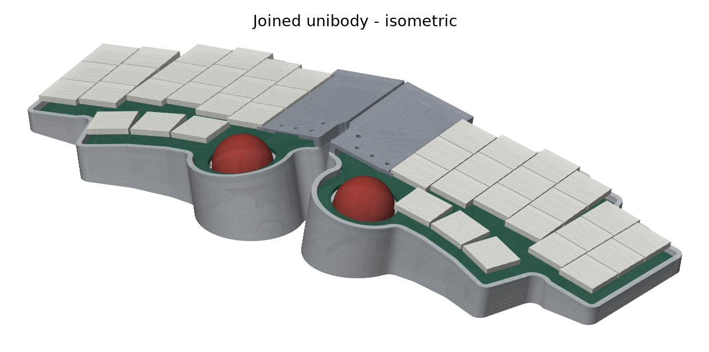
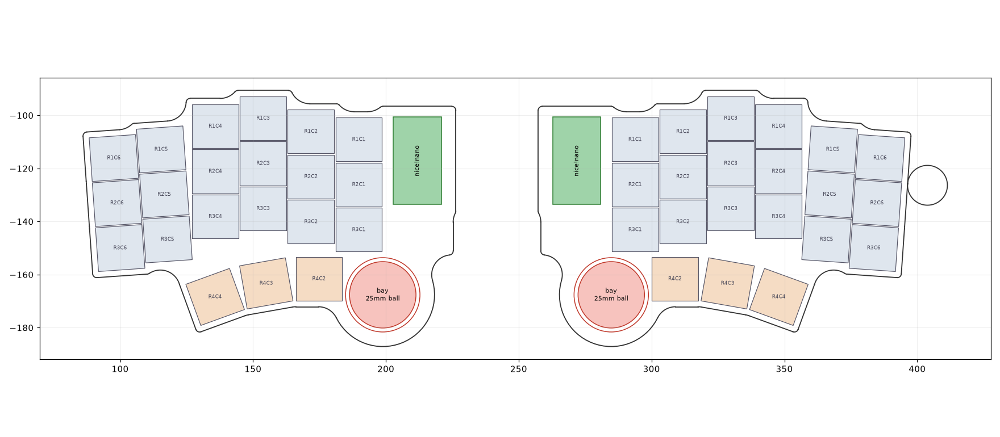
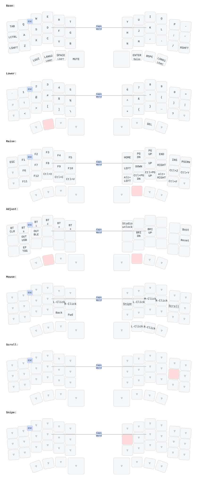
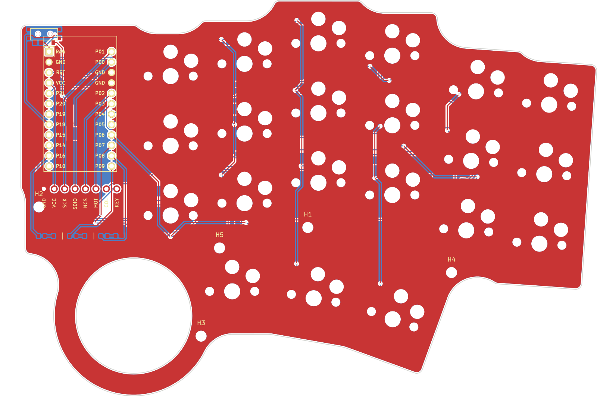

# Tsumugi（紡）— ロープロファイル無線分割トラックボールキーボード

> **紡（つむぎ）**: 左右ふたつの手を、ひとつのキーボードへ「紡ぐ」。
> 分割にも一体型にもなり、ボール・トラックパッド・エンコーダー・ブランクを自由に差し替えられる。





Tsumugi は、moNa2 / roBa / Keyball44 / 小人キー / 双掌（SO-SHO）/ Toucan / torabo-tsuki など、
いま手に入る「トラックボール付き分割キーボード」の良いところを整理し、
それぞれの弱点をまとめて解消することを目標に設計した **オープンソースの分割キーボード** です。
PCB・ケース・ファームウェア・キーマップ・製造データまで、すべてこのディレクトリから再生成できます。

> ⚠️ **ステータス: 設計 v0.1（試作前）** — ファームウェアは全バリアントのビルド成功、
> PCB は KiCad DRC エラー 0 / 未配線 0 を確認済みですが、**実機はまだ製作・検証していません**。
> 「検証状況」の節を必ず読んでください。

---

## 1. 既存製品の整理（公開情報ベース）

| | moNa2 | roBa | Keyball44 | 小人キー | 双掌 SO-SHO | Toucan | torabo-tsuki LP | **Tsumugi** |
|---|---|---|---|---|---|---|---|---|
| キー数 | 42 | 42 | 44（MX） | 40 | 44 | 42 | S/M/L | **42 + ベイ押下 2** |
| ポインタ | 25mm ボール 右 | 34mm ボール | 34mm ボール | **19mm ボール 左右** | 34mm ボール/パッド | 40mm トラックパッド | 19/25mm ボール | **25/19mm ボール・23mm パッド、左右どちらにも** |
| ピッチ | 17mm | — | 19mm | **16mm** | — | 17mm | — | 18 × 17mm（Choc 標準キャップ） |
| 無線 | ZMK | ZMK | 有線 | ZMK | 無線 | ZMK | ZMK・乾電池 | **ZMK・LiPo 約1000mAh** |
| モジュール交換 | — | — | — | — | ◯ ボール/パッド/カバー | — | ボール位置調整 | **ボール / パッド / EC11 / ブランク** |
| テント | 別途 | 別途 | 別途 | **ケース単体で角度可変** | — | — | — | **一体テント：25mm球 9.5/14/18°、19mm球 6.5/9.5/14/18° から選んで印刷** |
| 表示 | LED | — | OLED | — | — | メモリ LCD | LED | RGB 状態 LED |
| 連結 | 背面マグネット | — | — | — | — | — | — | **内側マグネットで一体化** |

特に参考にした点と、Tsumugi での答え:

- **moNa2**: 完成度の高い薄型・軽量・無線。→ Tsumugi は薄さよりも**テント付きの姿勢**と**モジュール交換**を優先（外側は約14mmと低いが、内側はテントで32mmになる）。重さもケース約125g/片側（PLA中実換算）で、moNa2 の軽さには及ばない。
- **roBa / Keyball44**: 親指ボールの操作感の定番。→ 同じ「親指の休む位置にボール」配置を採用し、**ボールを持つ側を BLE セントラル**にして遅延を最小化。
- **双掌 SO-SHO**: 左右どちらにもモジュールを付けられる柔軟性。ただしボール装着時は約40mmと厚い。→ **25mmボール + 一体テントの空間にポッドを収める**ことで、平置きでも出っ張らない。
- **小人キー**: 左右 19mm デュアルボール、ケース単体でのテント角調整、16mm 狭ピッチ。→ **19mm ボールにも対応**し、テント角は複数の角度のケースから選んでプリントする方式に。デュアルボールは「左=スクロール専用」として取り込んだ。狭ピッチは Choc 標準キャップの入手性を優先して見送り（18×17mm）。
- **Toucan**: 40mm Cirque トラックパッドとメモリ LCD。→ ベイに Cirque トラックパッド（タップでクリック）を載せられるようにした。当初 35mm を狙ったが親指キーに 2.25mm 干渉したため、ベイに収まる最大径 27.9mm 以下の **23mm（TM023023）** を採用。表示は電池寿命を優先して RGB LED に留めた。
- **Charybdis / cocot46plus**: スクロール・精密（スナイプ）モードの定番化、cocot の「Lower 中はボールがスクロール」。→ `;` 長押し・**Lower 長押しのどちらでもスクロール**、`H` 長押しで精密モード。
- **torabo-tsuki**: PAW3222 による低消費電力。→ 同じ PAW3222 を採用し、**ドライバのランタイム電源管理バグを修正**（このリポジトリの `src/paw3222.c`）。

出典: [moNa2 (BOOTH)](https://booth.pm/ja/items/6376654) ・
[moNa2 レビュー](https://sensai-gadget.com/mona2-first-impression/) ・
[roBa (BOOTH)](https://booth.pm/ja/items/6010869) ・
[Keyball44 (遊舎工房)](https://shop.yushakobo.jp/products/8337) ・
[双掌 SO-SHO (エレキット)](https://www.elekit.co.jp/product/TH-601) ・
[torabo-tsuki LP (BOOTH)](https://booth.pm/ja/items/7200248) ・
[小人キー ビルドガイド](https://note.com/11_50iii/n/n75cff4d3502c) ・
[小人キー (BOOTH)](https://booth.pm/ja/items/7511676) ・
[Toucan (beekeeb)](https://beekeeb.com/toucan-keyboard/) ・
[Charybdis (Bastard Keyboards)](https://bastardkb.com/charybdis/) ・
[cocot46plus (遊舎工房)](https://shop.yushakobo.jp/en/products/6955)

## 2. Tsumugi が「超える」ためにやったこと

1. **ボール・トラックパッド・エンコーダー・ブランクを差し替えられる「モジュールベイ」を左右両方に**
   8ピンのベイコネクタ（GND / 3V3 / SCK・SCL / SDIO・SDA / NCS / MOTION・DR / COL / KEY）で、
   PAW3222 ボール（25/19mm）・Cirque 23mm トラックパッド（I2C）・EC11 エンコーダー（押し込みはマトリクスの1キー）・ブランクを交換可能。
   左にもボールかパッドを付ければ **左=専用スクロール、右=カーソル** のデュアル構成になる。
2. **一体型テント（9.5°）の中にボールポッドと大容量電池を収納**
   25mmボールとセンサーは深さが要るが、内側が高くなるテントの空間に収めることで、
   ケース底面は平らなまま・ボールが机に当たらない（センサー基板と机の隙間 2.4mm）。
   同じ空間に **803040（約1000mAh）** の LiPo が入る。一般的な XIAO 系キーボードの 110〜300mAh 級より大きい。
3. **マグネットで「Λ」型の一体型キーボードに**
   左右の内側エッジに磁石を埋め込み、くっつければ一体型テントキーボード、
   離せば普通の分割キーボード。持ち運び時も1つにまとまる。
4. **ボール側を BLE セントラルに**
   カーソルの動きが左右間の無線リンクを通らないので、遅延と取りこぼしが最小。
5. **マウス操作の作り込み（すべてメインライン ZMK 機能のみで実装）**
   - 自動マウスレイヤー（ボールを動かすとクリックキーが出現、打鍵直後は誤発動しない）
   - `;` 長押し、または Lower 長押し（cocot46plus 式）でボールがスクロールに、`H` 長押しで 1/3 速の精密モード
   - デュアルボール時は左ボールが常時スクロール（縦横）
   - フォークに依存しないため、ZMK 本体の更新に追従しやすい
6. **ZMK Studio 対応**（右側に書き込む）。Studio 上のキー配置は **PCB と同じ座標から自動生成**。
7. **単一の設計ソース**: ergogen の点群 → PCB / ケース / ZMK 物理レイアウト / キーマップ図 がすべて同じ座標から生成されるので、食い違いが起きない。
8. **再現可能な製造データ**: `tools/build_pcb.sh` 一発で ergogen → KiCad → 自動配線 → DRC → ガーバーまで生成。
9. **状態 LED（RGB）**: 起動時の電池残量、接続状態、低電圧警告（zmk-rgbled-widget）。
10. **電源**: センサー電源は nice!nano の外部電源スイッチ経由。ディープスリープ時は ZMK が遮断。

## 3. 仕様

| 項目 | 値 |
|---|---|
| 配列 | 3×6 カラムスタッガード + 親指 3 キー（左右）+ モジュールベイ |
| キー数 | 42（+ エンコーダー押し込み用ベイ接点 ×2） |
| キーピッチ | 18 × 17 mm（Choc スペーシング、MBK 等の Choc キーキャップ） |
| スイッチ | Kailh Choc v1（PG1350）ホットスワップ |
| コントローラ | nice!nano v2 互換（Pro Micro nRF52840） |
| ポインティング | PixArt PAW3222 + 25mm / 19mm ボール（3mm セラミックボール 3点支持）、または Cirque 23mm トラックパッド |
| 接続 | BLE（最大5台）+ USB-C、ZMK Studio |
| PCB | 2層 1.6mm、片側 140.3 × 96.5 mm、左右別基板 |
| ケース | 3Dプリント（サポート不要）、一体テント、マグネット連結。片側 144.8 × 101.9 mm、高さ 32.0mm（25mm球・9.5°）/ 24.4mm（19mm球・6.5°） |
| ベイのふた | 23mm トラックパッド / EC11 / ブランク（磁石で着脱、左右共通） |
| 電池 | LiPo 803040（8×30×40mm、約1000mAh）×2 |

### ピン配置（左右共通）

| nice!nano | nRF | 機能 | nice!nano | nRF | 機能 |
|---|---|---|---|---|---|
| D4 | P0.22 | ROW1 | D21 | P0.31 | COL1（内側） |
| D5 | P0.24 | ROW2 | D20 | P0.29 | COL2 |
| D6 | P1.00 | ROW3 | D19 | P0.02 | COL3 |
| D7 | P0.11 | ROW4（親指） | D18 | P1.15 | COL4 |
| D1 | P0.06 | ベイ SCK / ENC A | D15 | P1.13 | COL5 |
| D0 | P0.08 | ベイ SDIO / ENC B | D14 | P1.11 | COL6（外側） |
| D2 | P0.17 | ベイ NCS | D8 | P1.04 | LED 赤 |
| D3 | P0.20 | ベイ MOTION | D9 | P1.06 | LED 緑 |
| D10 | P0.09 | 予備 | D16 | P0.10 | LED 青 |

## 4. ディレクトリ構成

```
keyboard/
├── pcb/ergogen/           # 設計ソース（config.yaml + 自作フットプリント）
├── pcb/output/            # 生成物: KiCad PCB, DRC レポート, ガーバー zip, プレビュー画像
├── case/                  # ケース CAD（build123d）と STL/STEP、レンダリング
├── firmware/              # ZMK シールド定義、キーマップ、build.yaml
├── docs/                  # キーマップ図（SVG）
└── tools/                 # 生成パイプライン
    ├── build_pcb.sh       #   ergogen → KiCad → Freerouting → DRC → ガーバー
    ├── geometry.py        #   単一の形状ソース（PCB外形/ケース/レイアウト共用）
    ├── gen_zmk_layout.py  #   ZMK Studio 用物理レイアウト生成
    ├── build_firmware.sh  #   全ファームウェアバリアントのビルド
    └── draw_keymap.sh     #   キーマップ図の生成
```

## 5. ファームウェア



`firmware/build.yaml` のバリアント（GitHub Actions `Tsumugi firmware` で自動ビルド）:

| ファイル | 書き込む側 | 構成 |
|---|---|---|
| `tsumugi_right_ball.uf2` | 右 | **標準**: 右ボール（セントラル、ZMK Studio 有効） |
| `tsumugi_left_blank.uf2` | 左 | 左ベイ = ブランク |
| `tsumugi_left_encoder.uf2` | 左 | 左ベイ = EC11 エンコーダー（音量、レイヤーで曲送り/ページ送り） |
| `tsumugi_left_scrollball.uf2` + `tsumugi_right_ball_dual.uf2` | 左 + 右 | デュアルボール（左=スクロール専用） |
| `tsumugi_left_scrollpad.uf2` + `tsumugi_right_ball_dual.uf2` | 左 + 右 | 左トラックパッド=スクロール、右ボール=カーソル |
| `tsumugi_right_trackpad.uf2` | 右 | 右ベイ = 23mm トラックパッド（カーソル、タップでクリック） |
| `settings_reset.uf2` | 両方 | 設定リセット |

ローカルビルド:

```sh
# west ワークスペースと Zephyr SDK 0.17 を用意した上で
ZMK_APP=/path/to/zmk/app EXTRA_MODULES=/path/to/zmk-rgbled-widget keyboard/tools/build_firmware.sh
```

レイヤー: `Base` / `Lower`（数字・記号）/ `Raise`（ナビ・F キー）/ `Adjust`（Lower+Raise：BT・USB/BLE 切替・ブートローダー）/
`Mouse`（自動）/ `Scroll` / `Snipe`。コンボ: `Q+W`=Esc、`F+J`=Caps Word。
親指の `LANG2`/`LANG1` は英数/かな（タップ）、ホールドでレイヤー。

> センサーの取り付け向きで X/Y の向きが変わります。実機で逆になったら
> `firmware/config/tsumugi.keymap` の `&cursor_listener` に
> `<&zip_xy_transform (INPUT_TRANSFORM_X_INVERT | INPUT_TRANSFORM_Y_INVERT)>` などを追加してください。

## 6. PCB



```sh
keyboard/tools/build_pcb.sh   # 要: node, ergogen 4.2.1, KiCad 7, Java 21, freerouting 2.1
```

- 出力: `pcb/output/tsumugi_{left,right}.kicad_pcb`、`tsumugi_{left,right}_gerbers.zip`（JLCPCB 等にそのまま入稿可能な構成）、`drc_{left,right}.txt`
- 右基板は nice!nano を**裏返し**で実装します（ピン列をキー側に向けるため。ファームウェアのピン定義は左右共通）。
- 設計ルール: 配線 0.25mm / クリアランス 0.2mm / ビア 0.6/0.3mm / 基板端 0.3mm、両面 GND ベタ
- ergogen の出力外形は壊れた円弧を含むため、`geometry.py` が shapely で外形を作り直しています。

## 7. 部品表（片側 ×2 ではなく、キーボード1台分）

| 部品 | 数量 | 備考 |
|---|---|---|
| PCB（左・右） | 各1 | 2層 1.6mm |
| nice!nano v2 互換（Pro Micro nRF52840） | 2 | 左は部品面を上、**右は部品面を下（裏返し）**に実装。右は約2mmのスペーサー付きピンで |
| Kailh Choc v1 スイッチ | 42 | |
| Choc ホットスワップソケット（PG1350） | 42 | |
| ダイオード 1N4148W（SOD-123） | 44 | 各キー + ベイ押し込み |
| スライドスイッチ MSK-12C02 | 2 | 電源 |
| タクトスイッチ（TL3342 系 SMD） | 2 | リセット（底面から押す） |
| 0603 LED 赤/緑/青 + 0603 抵抗 1kΩ | 各2組 | 状態表示 |
| LiPo 電池 803040（約1000mAh） | 2 | ケースの電池ポケット 31×41×8.5mm |
| PAW3222 センサーモジュール（レンズ付き） | 1〜2 | ベイ接続。ピン配置はベイコネクタに合わせて配線 |
| 25mm または 19mm ボール | 1〜2 | 19mm はテントを 6.5° まで下げられる |
| 3mm セラミックボール（Si3N4/ZrO2） | 3〜6 | ボール支持 |
| EC11 エンコーダー + ノブ | 0〜1 | エンコーダー構成時 |
| Cirque TM023023（23mm トラックパッド） | 0〜2 | トラックパッド構成時。I2C モード（R1 抵抗を外す）で使用 |
| 1×8 ピンヘッダ（2.54mm） | 2 | ベイコネクタ |
| M2 ねじ + M2 インサート | 10 | ケース固定 |
| 6×3mm ネオジム磁石 | 4 | 左右連結 |
| 5×2mm ネオジム磁石 | 2 + ふた1枚につき2 | ベイのふたの固定 |
| Choc キーキャップ | 42 | |

## 8. 検証状況（正直な現状）

| 項目 | 状態 |
|---|---|
| ZMK ファームウェア 8 バリアント | ✅ ローカルと GitHub Actions でビルド成功（ZMK main / Zephyr 4.1, nice_nano） |
| PAW3222 ドライバ修正 | ✅ `CONFIG_PM_DEVICE_RUNTIME=y` でもコンパイル確認。実機での動作は未確認 |
| PCB 左・右 | ✅ 自動配線後の KiCad DRC エラー 0、未接続 0（残りはライブラリ参照・シルク重なり等の警告のみ） |
| ケース | ✅ 左右とも水密 STL・単一ボディ、机面より下にはみ出さない、部品同士の干渉ゼロをモデル上で確認。スライサー・試し刷りは未実施。部品実寸（USB-C、スペーサー付き nice!nano、J1 ヘッダ）との照合は未検証 |
| ケースの既知の課題 | ⚠️ 右ポッドに肉厚 0.4mm の箇所が1か所ある（試作前に要修正）。EC11 の回り止め溝の位置は未確認。エンコーダーのふたを使うときはセンサーモジュールを外す |
| 実機試作・打鍵感・ボール操作感・電池寿命 | ❌ 未検証（試作が必要） |
| PAW3222 モジュールのレンズ距離・ピン配置 | ❌ 使うモジュールに合わせた確認が必要 |

## 9. ロードマップ

1. v0.1 基板を発注（左右 各5枚）→ 組み立て → キースキャン・センサー・BLE の動作確認
2. ボール高さ・ベアリング位置・テント角を実測で調整（`case/case.py` のパラメータ）。J1 は通常高さのピンヘッダだと MCU カバーに当たるので、低背ヘッダかケーブル直付けにする
3. 電池寿命の実測と `CONFIG_PAW3222_POLL_INTERVAL_MS`・スリープ時間の最適化
4. v0.2: 実測を反映、ドングル構成（3台目の nRF52840 をセントラルに）への対応

## ライセンス

リポジトリの `LICENSE`（Apache-2.0）に従います。
